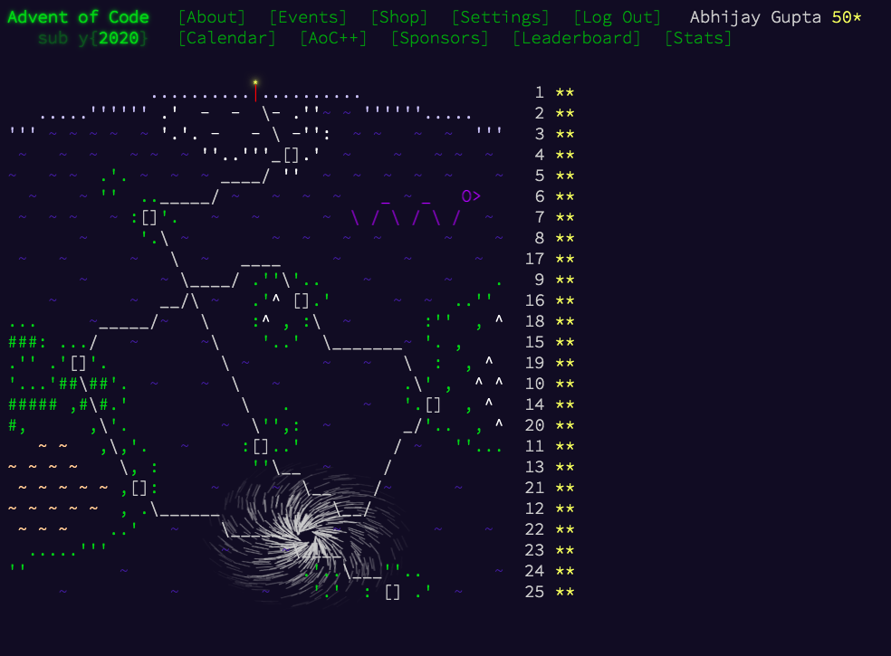

# Advent of Code 2020

From the [About](https://adventofcode.com/2020/about) page of Advent of Code -

> Advent of Code is an Advent calendar of small programming puzzles for a variety of skill sets and skill levels that can be solved in any programming language you like. People use them as a speed contest, interview prep, company training, university coursework, practice problems, or to challenge each other.

## Current Status

